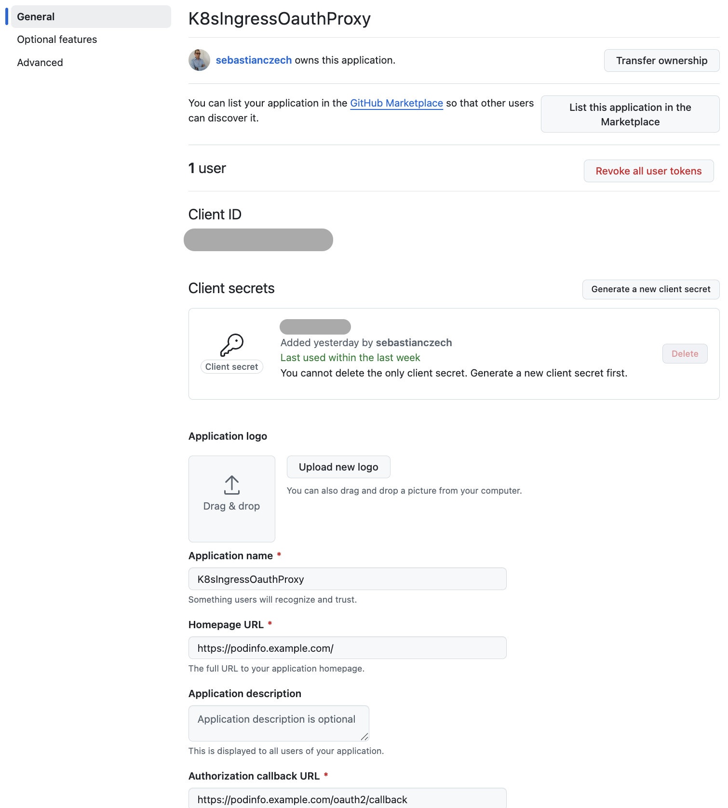

# Ingress Nginx controller with authentication

## Ingress

### Links

* [Kind Ingress](https://kind.sigs.k8s.io/docs/user/ingress/)

### Prerequisites

1. Create Kubernetes cluster using [`kind`](https://kind.sigs.k8s.io/docs/user/quick-start/):
```bash
task cluster-create
```
2. Configure [ingress](https://kind.sigs.k8s.io/docs/user/ingress)
```bash
task cluster-ingress-setup
```
3. Define DNS names on local machine e.g.:
```
vi /etc/hosts
```
and add 3 FQDNs for `localhost`:
```
127.0.0.1       localhost podtato.example.com podinfo.example.com foobar.example.com
```

### Bearer Token

1. Setup [Kubernetes dashboard](https://kubernetes.io/docs/tasks/access-application-cluster/web-ui-dashboard/):
```bash
task dashboard-ingress-setup
```
2. Access dashboard [https://localhost:8443](https://localhost:8443/#/workloads?namespace=_all)

### OAuth proxy

#### [GitHub](https://oauth2-proxy.github.io/oauth2-proxy/configuration/providers/github)

1. [Configure GitHub OAuth application](https://docs.github.com/en/apps/oauth-apps/building-oauth-apps/creating-an-oauth-app) in [https://github.com/settings/applications/new](https://github.com/settings/applications/new):

2. Provision [OAuth proxy](https://kubernetes.github.io/ingress-nginx/examples/auth/oauth-external-auth/):
```bash
task oauth-proxy-setup
```
3. Create `podinfo` app:
```bash
task app-podinfo-setup
```
4. Check app [https://podinfo.example.com/](https://podinfo.example.com/)

#### [Microsoft Entra ID](https://oauth2-proxy.github.io/oauth2-proxy/configuration/providers/ms_entra_id)

1. Configure app registration
```bash
az login

terraform init
terraform apply -auto-approve
terraform output -raw client_id > client_id.txt
terraform output -raw client_secret > client_secret.txt
terraform output -raw sp_id > sp_id.txt
terraform output -raw tenant_id > tenant_id.txt
terraform output -raw group_id > group_id.txt
terraform output -raw oidc_issuer_url > oidc_issuer_url.txt
```
2. Check app registration
```bash
az account subscription list
az ad app list
```
3. Provision [OAuth proxy](https://kubernetes.github.io/ingress-nginx/examples/auth/oauth-external-auth/):
```bash
task oauth-proxy-setup
```
4. Create `podinfo` app:
```bash
task app-podinfo-setup
```
5. Check app [https://podinfo.example.com/](https://podinfo.example.com/)

### Basic authentication

1. Provision [Basic authentication](https://kubernetes.github.io/ingress-nginx/examples/auth/basic/)
2. Create `podtato`:
```bash
task app-podtato-setup
```
3. Access app [https://podtato.example.com/](https://podtato.example.com/)

### Client certificate authentication

1. Provision [Client certificate authentication](https://kubernetes.github.io/ingress-nginx/examples/auth/client-certs/)
2. Create `foo-bar` app:
```bash
task app-foo-bar-setup
```
3. Check app [bar](https://foobar.example.com/bar) and [foo](https://foobar.example.com/foo):
```bash
task app-foo-bar-check
```

More information:
- [SSL/TLS in Learning CI/CD](https://github.com/sebastianczech/Learning-CI-CD#ssltls)
- [Add SSL / TLS Certificate or .PEM file to Kubernetes’ Pod’s trusted root ca store](https://paraspatidar.medium.com/add-ssl-tls-certificate-or-pem-file-to-kubernetes-pod-s-trusted-root-ca-store-7bed5cd683d)

## Gateway API

### Links

* [Gateway API](https://gateway-api.sigs.k8s.io/)
* Implementations:
  * [Blixt - load balancer for K8s](https://github.com/kubernetes-sigs/blixt#usage)
  * [NGINX Gateway Fabric](https://docs.nginx.com/nginx-gateway-fabric/get-started/)

### Prerequisites

1. Create Kubernetes cluster using [`kind`](https://kind.sigs.k8s.io/docs/user/quick-start/):
```bash
kind create cluster --config code/single-node-extra-port-mapping-gateway-api.yaml --name home-lab
```
2. Deploy `blixt`
```bash
kubectl apply -k https://github.com/kubernetes-sigs/gateway-api/config/crd/experimental?ref=v1.2.1

cd ..
git clone https://github.com/kubernetes-sigs/blixt

make build.all.images TAG=latest
make load.all.images TAG=latest
kubectl apply -k config/default
```
3. Deploy ``:
```bash
kubectl kustomize "https://github.com/nginx/nginx-gateway-fabric/config/crd/gateway-api/standard?ref=v1.6.2" | kubectl apply -f -

helm install ngf oci://ghcr.io/nginx/charts/nginx-gateway-fabric --create-namespace -n nginx-gateway --set service.create=false

kubectl apply -f code/gateway-api-node-port.yaml
```
4. Create `cafe` application:
```bash
kubectl apply -f code/app-cafe.yaml
```
5. Define DNS names on local machine e.g.:
```
vi /etc/hosts
```
and add 1 FQDNs for `localhost`:
```
127.0.0.1       localhost cafe.example.com
```
6. Check application:
```bash
kubectl describe httproutes
kubectl describe gateways

curl --resolve cafe.example.com:8080:127.0.0.1 http://cafe.example.com:8080/coffee
curl --resolve cafe.example.com:8080:127.0.0.1 http://cafe.example.com:8080/tea
```
